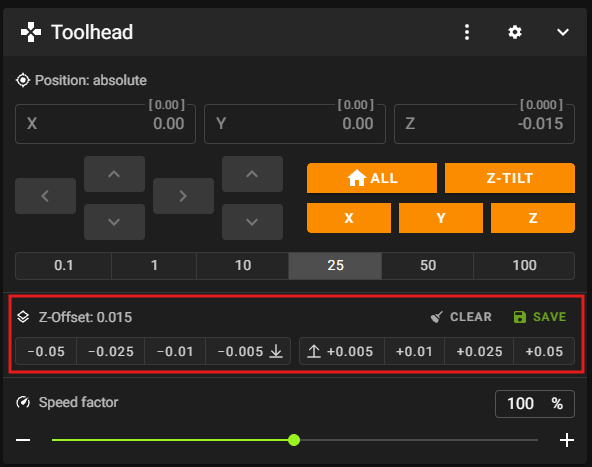

# Beacon

- [Prerequisites](#prerequisites)
- [Notable Changes in RatOS 2.1.0-RC4](#notable-changes-in-ratos-210-rc4)
- [Recommended Workflow](#recommended-workflow)
- [Fully automated RatOS Beacon calibration](#fully-automated-ratos-beacon-calibration)
- [Initial calibration](#1-initial-calibration)
- [Beacon latency check](#2-beacon-latency-check)
- [Hotend expansion calibration](#3-hotend-expansion-calibration)
- [Beacon Scan Compensation](#5-beacon-scan-compensation)
- [Final calibration](#5-final-calibration)
- [First print and fine tuning](#6-first-print-and-fine-tuning)
- [RatOS configuration](#7-ratos-configuration)
- [Beacon Tools](#8-tools)
- [FAQ](#9-faq)

:::info First Layers
Please read the [First Layers](configuration/first_layers.md) section, as there are significant improvements to first layer accuracy and consistency with beacon in RC4.
:::

:::warning Using Damaged Build Sheets
Do not use beacon true zero (with or without the [true zero correction feature](beacon_true_zero_correction.md)) with a build sheet with significant damage around the safe home position (by default, the middle of the sheet). If an area with missing coating is probed, true zero can be set to a Z height that is significantly lower than the actual coating surface, which can lead to nozzle crashes and further damage to the build sheet.
:::

## Prerequisites

Please read the official [beacon contact documentation](https://docs.beacon3d.com/contact/), but do not follow any installation instructions. Beacon is already installed and configured in RatOS, you just need to connect it to your Raspberry Pi.

:::warning
Heatsoaking is an important part of achieving consistent first (and early) layers, especially on larger printers. RatOS 2.1.0-RC4 introduces a new adaptive heatsoaking feature that uses beacon proximity measurements to determine when the printer has reached thermal stability. This feature is is enabled by default for V-Core 4.x printers. Fixed-duration heatsoaking is also available, but must be configured. See [Heatsoaking](heatsoaking.md) for more information.
:::

## Notable Changes in RatOS 2.1.0-RC4

- Baby stepping adjustments are now saved with the Klipper standard `Z_OFFSET_APPLY_PROBE` command instead of the deprecated `SAVE_Z_OFFSET` command. Note that when the recommended workflow is used, many users find that they never have to perform any Z-offset adjustment. See [First print and fine tuning](#6-first-print-and-fine-tuning) for more information.
- The calculation of Beacon Scan Compensation meshes has been improved. Old compensation meshes are not compatible with the new system and must be recreated. See [Beacon Scan Compensation](#4-beacon-scan-compensation) for more information.
- Beacon Scan Compensation is now recommended for all printers and is enabled by default. See [Beacon Scan Compensation](#4-beacon-scan-compensation) for more information.

## Recommended Workflow

When a beacon sensor is present, RatOS is configured by default to follow the following beacon-related workflow. It is highly recommended to use this workflow as it provides the best performance and user experience. Only deviate from this workflow if you have a specific reason to do so.

### Beacon Contact True Zero and Model Calibration

The recommended (and default) workflow is to enable `variable_beacon_contact_start_print_true_zero` and `variable_beacon_contact_calibrate_model_on_true_zero`. This will ensure that a new beacon model is calibrated at the start of each print, adapting to different build sheets and temperatures as automatically. The [final Calibration](#5-final-calibration) step is not required when using the recommended workflow. This workflow follows the [beacon recommendation](https://docs.beacon3d.com/contact/#53-print-start-gcode).

If the recommended workflow is not used, it may be necessary to maintain multiple beacon models for different build sheets and temperatures. However, RatOS does not have any features to help manage multiple beacon models. Refer to the [beacon model documentation](https://docs.beacon3d.com/models/) for more information about beacon models and beacon's model management features.

### Beacon Contact True Zero Correction

RatOS includes the `[beacon_true_zero_correction]` module which implements a multipoint probing strategy to improve the accuracy and consistency of true zero measurements. This feature recommended for all printers and is enabled by default. See [Beacon True Zero Correction](beacon_true_zero_correction.md) for more information.

### Beacon Scan Compensation

Beacon scan compensation recommended for all printers, and is enabled by default. Unless you opt out, you must create at least one beacon scan compensation mesh before printing. See [Beacon Scan Compensation](#5-beacon-scan-compensation) for more information.

### Heatsoaking

Heatsoaking is an important part of achieving consistent first (and early) layers, especially on larger printers. RatOS includes a new adaptive heatsoaking feature that uses beacon proximity measurements to determine when the printer has reached thermal stability. This feature is is enabled by default for V-Core 4.x printers. Fixed-duration heatsoaking is also available, but must be configured. See [Heatsoaking](heatsoaking.md) for more information.

## Fully automated RatOS Beacon calibration

RatOS comes with a fully automated Beacon model and temperature offset calibration.

The [recommended workflow](#recommended-workflow) section descrives the default confguration of various beacon-releated features. If you want to deviate from the recommended workflow, make any configuration changes before starting the calibration.

:::warning
Heatsoaking is an important part of achieving consistent first (and early) layers, especially on larger printers. RatOS includes a new adaptive heatsoaking feature that uses beacon proximity measurements to determine when the printer has reached thermal stability. This feature is is enabled by default for V-Core 4.x printers. Fixed-duration heatsoaking is also available, but must be configured. See [Heatsoaking](heatsoaking.md) for more information.
:::

1. Run `BEACON_RATOS_CALIBRATE BED_TEMP=85 CHAMBER_TEMP=45`. Use your target temperature for the `BED_TEMP` and `CHAMBER_TEMP` parameter. `CHAMBER_TEMP` is optional, and can be omitted.

The automated beacon calibration will run the following calibrations and tests, which can also be used individually. Please make sure to read every section before starting the calibration.

- [Initial calibration](#1-initial-calibration)
- [Beacon latency check](#2-beacon-latency-check)
- [Hotend expansion calibration](#3-hotend-expansion-calibration) (for non IDEX printer)
- [Beacon Scan Compensation](#4-beacon-scan-compensation)
- [Final calibration](#5-final-calibration)

All calibration results will be saved automatically, and no user action is required. Klipper will restart on its own after the calibration is complete.

After automatic calibration is complete, follow the instructions in [first print and fine tuning](#6-first-print-and-fine-tuning) to perform the first print and fine tune the Z-offset if necessary.

## 1. Initial calibration

We need to create an initial Beacon model to be able to home the printer.

1. Run `BEACON_INITIAL_CALIBRATION`

It will home your printer and run the calibration fully automated. This command can throw a tolerance error - in this case, simply repeat it until the command completes successfully.

For safety and peace of mind, the LED will turn on as soon as the contact system determines it has a strong enough signal for detection. It should normally turn on up to 10mm in advance of the metal target, allowing enough time to manually e-stop the machine if necessary.

2. Run `SAVE_CONFIG` to save the model to your printer.cfg file.

## 2. Beacon latency check

This test will show you the quality of your Beacon probing.

- Run `BEACON_POKE_TEST`

It will home your printer and poke the bed multiple times. After the test completes, check the console output - it should look similar to this:

```
Overshoot: 35.625 um
Triggered at: z=0.07369 with latency=2
Armed at: z=4.76021
Poke test from 5.000 to -0.300, at 3.000 mm/s
```

Compare your latency values with the following list.

| Score | Notes                                                                   |
| ----- | ----------------------------------------------------------------------- |
| 0-1   | Extremely low noise, rarely achieved                                    |
| 2-4   | Excellent performance for a typical printer                             |
| 5-8   | Acceptable performance, machine may have considerable cyclic axis noise |
| 9-11  | Not ideal, may want to verify proper mounting or use thinner stackups   |
| 12-14 | Reason for concern, present setup may be risky to continue with         |

## 3. Hotend expansion calibration

RatOS comes with built-in hotend expansion calibration and compensation.

**Preparation**

- Unload filament from the nozzle
- Make sure the nozzle is clean and that no filament is leaking out of it. Make a manual cold pull or use the RatOS `COLD_PULL` macro
- Let the machine cool down to ambient temperature
- Do **NOT** perform this calibration on a smooth PEI sheet - in this case, turn the sheet around and calibrate on its bare metal surface

**Cold Pull Macro**

The cold pull macro lets you perform an automated cold pull to clean your nozzle. Before the cold pull, 30mm of filament will be extruded at the specified `EXTRUSION_TEMP`.

The default values work well for PLA cold pulls. For PETG and ABS, you should use higher temperatures like `EXTRUSION_TEMP=250 COLD_PULL_TEMP=95`. If you hear skipping during the cold pull, slightly increase the `COLD_PULL_TEMP`.

```
COLD_PULL EXTRUSION_TEMP=220 COLD_PULL_TEMP=80 TOOLHEAD=0
```

**Single toolhead printer**

- Run `BEACON_CALIBRATE_NOZZLE_TEMP_OFFSET`

This command will home your printer and run the calibration automatically. The process will take some time to complete.

**IDEX printer**

- Start VAOC
- Center both nozzles over the camera
- Click the `Calibrate Thermal Expansion` button in VAOC

This will automatically calibrate both nozzles. The process will take some time to complete.

It is recommended to repeat this calibration whenever you change a nozzle or before loading new filament.

After the test finishes, check the console output. A typical result looks like this:

```
RatOS | Beacon: T0 expansion coefficient: 0.075000
```

This value is in millimeters and represents the thermal expansion for a temperature difference of 100°C. RatOS uses this value to automatically calculate and apply the needed offset. The result is automatically saved to the configuration file - no user action is required.

### Typical expansion coefficients
If the measured epansion coefficient is significantly different from typical values, you may want to re-run the calibration.
- Phaetus Rapido 2+ UHF: 0.06 - 0.08 mm/100°C

## 4. Beacon Scan Compensation

:::info
Beacon Scan Compensation is now recommended for all printers and is enabled by default.
:::

:::warning
The measurement and calculation of Beacon Scan Compensation meshes has been significantly improved in RatOS 2.1.0-RC4. Old compensation meshes are not compatible with the new system and must be recreated. Incompatible meshes will be marked for deletion automatically when RatOS starts up.
:::

A beacon proximity measurement does not measure the actual distance between the nozzle and the bed surface. Instead, it uses the beacon coil to characterise eddy currents induced in the conductive components of the bed and build sheet stackup, then uses a model to convert the measured value into a Z distance between the coil and the bed. The beacon model is most accurate at the bed location and conditions under which it was created. Proximity measurments taken at other locations on the bed are subject to variations in eddy current behaviour caused by variations in the bed stackup. The recommeded workflow calibrates a new beacon model at the centre of the bed at start of each print to adapt to different build sheets and temperatures automatically, but this cannot compensate for variations in eddy response across the bed surface.

In addition to variations in eddy current response across the bed surface, toolhead twist (for example, due to gantry flex or twist) changes the Z-axis distance between the beacon coil and the nozzle tip at different bed locations. Variations in build sheet surface coating thickness (for example, due to uneven application of PEI or other surface coatings) also change the effective distance between the beacon coil and the bed surface at different bed locations, beacuse the surface coating is typically non-conductive.

The Beacon Scan Compensation feature in RatOS allows you to compensate for these effects by creating a compensation mesh that corrects proximity measurements based on the actual measured distance between the nozzle and the bed surface at multiple locations across the bed.

:::info
The old `BEACON_MEASURE_GANTRY_TWIST` command has been deprecated. It still exists, but has been renamed to `BEACON_MEASURE_BEACON_OFFSET`. However, it is not recommended to use this command anymore as it does not provide sufficient information or accuracy to determine if scan compensation is needed.
:::

From extensive testing, it has been found that most printers benefit from scan compensation. The best way to confirm if your printer will benefit from scan compensation is to create a scan compensation mesh, and then load up the compensation mesh in the Mainsail heightmap viewer and look at the `Range` value. When printing a first layer, devations of more than around +- 0.015mm can lead to visible or structural inconsistencies. So if the `Range` value is more than around 0.030mm, you will likely benefit from scan compensation. In testing, most printers have shown a range of more than 0.070mm, and many printers have shown ranges of more than 0.100mm.

### Configuring Scan Compensation
:::info
Scan compensation is enabled by default, with `"auto"` profile selection. If more than one profile exists for the same bed temperature, you must specify a specific profile name instead of using `"auto"`.
:::
To specifically configure scan compensation, add the following to your `printer.cfg`:
```properties
[gcode_macro RatOS]
variable_beacon_scan_compensation_enable: True          # Enables beacon scan compensation
variable_beacon_scan_compensation_profile: "auto"       # Use "auto" for automatic selection based on bed temperature, or specifiy the profile name of a
                                                        # previously created compensation mesh. If two compensation meshes exist for the same bed temperature,
                                                        # "auto" cannot be used and a specific profile name must be specified.
```

### Creating Compensation Meshes

1. Run `BEACON_CREATE_SCAN_COMPENSATION_MESH BED_TEMP=85 CHAMBER_TEMP=45` to create a compensation mesh.

Use your target temperatures for the `BED_TEMP` and `CHAMBER_TEMP` parameters. The command will home your printer, heat it to the target temperatures, wait for thermal stabilization, and create the compensation mesh automatically.

The compensation mesh creation process automatically determines the appropriate mesh name based on the bed temperature. Alternatively, you can specify a custom profile name using the `PROFILE` parameter, for example:

```properties
BEACON_CREATE_SCAN_COMPENSATION_MESH BED_TEMP=85 PROFILE="PEI_PC_85"
```

2. You'll need a compensation mesh for different bed temperature ranges, and potentially for different build sheets.

When using `variable_beacon_scan_compensation_profile: "auto"`, RatOS will automatically select the most appropriate compensation mesh based on your current bed temperature.

:::warning
If two compensation meshes exist for the same bed temperature, "auto" cannot be used and a specific profile name must be specified. In this case, RatOS will raise an error during printing if "auto" is used.
:::

3. Compensation is automatic during printing - no additional user action is required.

Click the image to open the video and see the results in action

[](https://youtu.be/qjRhAHsX0Hc)

## 5. Final Calibration

:::info
This step is only required if you are **not** using the [recommended workflow](#recommended-workflow) and you have configuered `variable_beacon_contact_calibrate_model_on_true_zero` as `False`.
:::

For scan method Z-homing, we should create a Beacon model under real operating conditions. While optional, this step is recommended.

- Run `BEACON_FINAL_CALIBRATION BED_TEMP=85 CHAMBER_TEMP=45`

Use your target temperatures for the `BED_TEMP` and `CHAMBER_TEMP` parameters. This command will home your printer and run the calibration automatically.

- Run `SAVE_CONFIG` to save the model to `printer.cfg`.

## 6. First print and fine tuning

:::info
If you are using the [recommended workflow](#recommended-workflow), many users find that you never need to perform babystepping adjustments. The true zero correction feature ensures that the nozzle is always at the correct height for the first layer, and the adaptive heatsoaking feature helps to ensure consistent first layers without needing to judge how much soaking is required.
:::
:::warning
Before printing, you should understand [Heatsoaking](heatsoaking.md) and how it affects first layer quality. Adaptive heatsoaking is enabled by default for V-Core 4.x printers, with default settings that should be appropriate for typical printing, for first layers that take up to 30 minutes to print. Other printers should be configured before printing. Larger printers with bi-metallic gantry construction may experience significant thermal Z deflection during the first layer if not adequately heatsoaked, which can lead to build sheet damage.
:::

For first layer test prints, ideally you should use filament that is already calibrated, particularly for bed and hotend temperature, extrusion multiplier and pressure advance. Using a reputable filament with a matching filament profile from a reputable source can help to ensure good first layers and reduce the need for adjustments. Also ensure that the filament is dry and is compatible with your build sheet surface.

- Print a 150x30mm single layer rectangle in the middle of the build plate.

If you are using the [recommended workflow](#recommended-workflow), many users find that you **never need to perform babystepping adjustments**. There can be many causes for imperfect first layers, and with the improvements to true zero calibration and compensation in RatOS 2.1.0-RC4, nozzle height is often not the primary cause of first layer issues. See [first layers](first_layers.md) for more information.

If you do wish to make small Z-offset adjustments, you can do so using baby stepping while printing the first layer. The procedure has changed between RatOS 2.1.0-RC3 and RC4. In RC4, the normal Klipper/Mainsail workflow common to many Z-probes is used:

- While printing, *if necessary*, fine-tune using the Z-offset adjustment buttons in Mainsail Z-Offset section.
- Click the `SAVE` button in the Mainsail Z-Offset section to save the adjustment, or run the `Z_OFFSET_APPLY_PROBE` command.
- Use the `SAVE_CONFIG` command to save the adjustment to `printer.cfg`. If you restart Klipper without saving the config, the adjustment will be lost.


:::info Z-Offset Display in RC3 versus RC4
In RatOS 2.1.0-RC3, the Z-offset shown in Mainsail would often be a strange "random looking" value that did not match Z-Offset adjustments being made. In RC4, the Z-offset shown in Mainsail now behaves like it would with vanilla Klipper: the value is typically zero, unless you are in the process of making a Z-offset adjustment, in which case it will show the current adjustment being made.
:::

## 7. RatOS configuration
:::warning
The configuration documentation below may be out of date and is pending review.
:::

The Beacon contact feature is activated by default, so no configuration is required. However, you can override the settings to enable additional Beacon contact features if desired. Simply copy and paste the relevant configuration sections below into your printer.cfg file and modify the settings as needed.

For a complete reference of all Beacon-related variables, see the [Beacon probe section in the macros documentation](/docs/configuration/macros#beacon-probe).

### Basic Configuration

```properties
[gcode_macro RatOS]
variable_beacon_bed_mesh_scv: 25                        # Square corner velocity for bed meshing with proximity method
variable_beacon_contact_prime_probing: True             # Probes for priming with contact method
variable_beacon_contact_expansion_compensation: True    # Enables hotend thermal expansion compensation
```

### True Zero Settings

```properties
[gcode_macro RatOS]
variable_beacon_contact_start_print_true_zero: True     # Uses contact to determine true Z=0 during START_PRINT
variable_beacon_contact_start_print_true_zero_fuzzy_position: True  # Randomizes true zero position to avoid wear marks
variable_beacon_contact_calibrate_model_on_true_zero: True  # Calibrate a new beacon model when performing True Zero.
                                                            # This is the recommended workflow.
variable_beacon_contact_wipe_before_true_zero: True     # Enables nozzle wipe before true zeroing
variable_beacon_contact_true_zero_temp: 150             # Nozzle temperature for true zeroing
                                                        # WARNING: If using a smooth PEI sheet, be careful with temperature
```

### Contact Mode Settings (Not Recommended)

:::warning
Using contact mode for homing, bed mesh, or z-tilt is not recommended on textured surfaces due to potential significant variation in contact measurements.
:::

```properties
[gcode_macro RatOS]
variable_beacon_contact_z_homing: False                 # Makes all G28 calls use contact instead of proximity scan
variable_beacon_contact_bed_mesh: False                 # Performs bed mesh with contact method
variable_beacon_contact_bed_mesh_samples: 2             # Number of probe samples for contact bed mesh
variable_beacon_contact_z_tilt_adjust: False            # Performs z-tilt adjust with contact method
variable_beacon_contact_z_tilt_adjust_samples: 2        # Number of probe samples for contact z-tilt adjust
```

### Scan Compensation

```properties
[gcode_macro RatOS]
variable_beacon_scan_compensation_enable: False         # Enables beacon scan compensation
variable_beacon_scan_compensation_profile: "auto"       # Use "auto" for automatic selection or specify profile name
variable_beacon_scan_compensation_desired_spacing: 10   # Desired spacing between probe points (mm)
variable_beacon_scan_compensation_bed_temp_mismatch_is_error: False  # Raise error on temp mismatch
variable_beacon_scan_method_automatic: False            # Enable METHOD=automatic scan option (not recommended)
```

### Adaptive Heat Soak

Adaptive heat soak monitors thermal stability using Beacon proximity measurements, reducing thermal Z deflection during the first layer.

```properties
[gcode_macro RatOS]
variable_beacon_adaptive_heat_soak: False               # Enable adaptive heat soaking (enabled by default on V-Core 4)
variable_beacon_adaptive_heat_soak_max_wait: 5400       # Maximum wait time in seconds
variable_beacon_adaptive_heat_soak_extra_wait_after_completion: 0  # Extra wait time after soak completes
variable_beacon_adaptive_heat_soak_layer_quality: 3     # Quality level: 1=rough (fast), 5=maximum (slow, best quality)
variable_beacon_adaptive_heat_soak_maximum_first_layer_duration: 1800  # Maximum first layer time (60-7200 seconds)
```

### Advanced Settings

```properties
[gcode_macro RatOS]
variable_beacon_contact_poke_bottom_limit: -1           # The bottom limit for the contact poke test
```

## 8. Tools

### Measuring Z-Axis Backlash

The Beacon macro `BEACON_ESTIMATE_BACKLASH` allows you to measure the backlash in your printer's setup. Before using this macro, ensure your printer is homed and the bed is properly leveled.

```
Median distance moving up 1.99990, down 2.00286, delta 0.00296 over 20 samples
```

The delta value represents your backlash in millimeters.

## 9. FAQ

### Q: How can I set different Z-offsets for different filaments?

A: If you want to have different Z-offsets for different filament profiles, you can use `SET_GCODE_OFFSET Z_ADJUST=+0.01` for positive adjustments or `SET_GCODE_OFFSET Z_ADJUST=-0.01` for negative adjustments in your filament profile's custom G-code section.

### Q: What happened to SAVE_Z_OFFSET?

A: The `SAVE_Z_OFFSET` command has been replaced with `Z_OFFSET_APPLY_PROBE`. Use `Z_OFFSET_APPLY_PROBE` to save your Z-offset adjustments after baby stepping.
