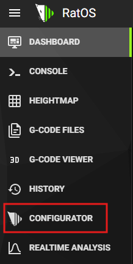
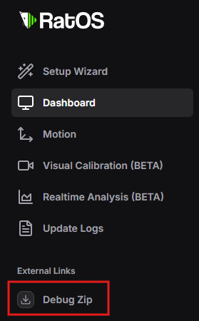
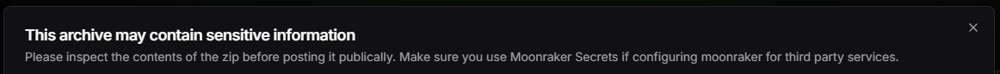
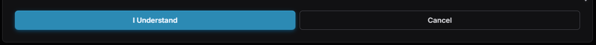

# Troubleshooting

## My steppers are running backwards!

Refer to the stepper section at the top of printer.cfg, you can add or remove `!` in front of the dir_pin to reverse the direction of that particular stepper.

## Everytime i update my changes are gone.

You're not supposed to change `RatOS.cfg` or _any_ files inside the managed `RatOS` config folder. All your configuration changes should be made in `printer.cfg` or by including custom cfg files, if you need to change settings refer to the [Inlcudes & Overrides Documentation](/docs/configuration/includes-and-overrides) section.

## Klipper says the MCU is unable to connect

Double check your USB connection, try another cable (the one that comes with the board usually works), and check that your firmware is flashed correctly using the RatOS configurator wizard at [http://RatOS.local/configure/wizard](http://RatOS.local/configure/wizard).

## I updated klipper and now i get an error!

Check that your firmware is flashed correctly using the RatOS configurator wizard at [http://RatOS.local/configure/wizard](http://RatOS.local/configure/wizard).

If you're still having issues, run the RatOS CLI doctor command to ensure your system is in a working state:

```bash
ssh pi@RatOS.local
ratos doctor
```

## Section 'gcode_shell_command generate_shaper_graph_x' (or others) is not a valid config section

This happens if you hard reset klipper through mainsail, your setup can be recovered using the RatOS CLI doctor command:

```bash
ssh pi@RatOS.local
ratos doctor
```

After this command has completed, your system should be back in a working state.

## Connection to moonraker failed

If you see the mainsail interface but you get an error about the connecting to moonraker, the connection to the pi is fine, but you're using a non standard IPv4 or IPv6 range that is not whitelisted in moonraker (only standard local ip ranges are whitelisted for security reasons). Try using the ip address of your pi (look it up in your routers admin interface) instead of ratos.local, or fix it by adding your IP range in CIDR notation to the `[authorization]` section in ~/klipper_config/moonraker.conf on the pi. You can do that through SSH, by running:

```
ssh ratos.local
nano ~/klipper_config/moonraker.conf
sudo systemctl restart moonraker
```

Alternatively you can delete the entire `[authorization]` section, which will allow anyone to connect to moonraker (which is a security risk).

## Get help

For further support check out the RatOS-support and klipper channels on Discord. Use the invite link below to join.

<a href="https://discord.gg/ratrig" class="button button--primary">Join the Unnofficial RatRig Discord Community</a>

## Creating a "debug.zip" file

The RatOS configurator has a built in tool to create a `debug.zip` file that contains all the relevant logs and configuration files for troubleshooting. This is especially useful when asking for help in the Discord community, as it allows others to see your configuration and logs to better understand your issue. To create a `debug.zip` file, follow these steps:

1. In Mainsail, click on the `CONFIGURATOR` button in the left sidebar:


2. In the configurator, click on the `Debug Zip` button in the left sidebar:


3. In the pop up panel, review the warning. If you want to proceed, click the `I Understand` button.



4. A file named `ratos-debug.zip` will be downloaded to your computer. Your browser may block the download, so make sure to allow it if prompted. If a file with the same name already exists, your browser may automatically rename the new file to `ratos-debug (1).zip` or similar.