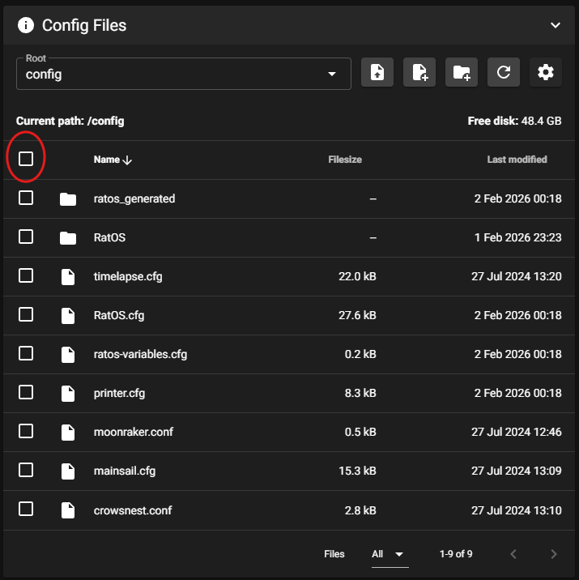
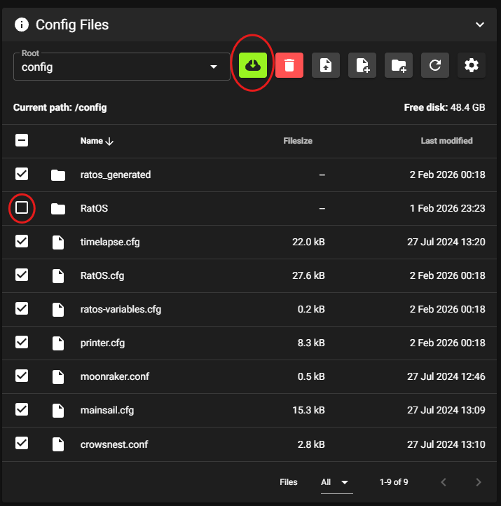
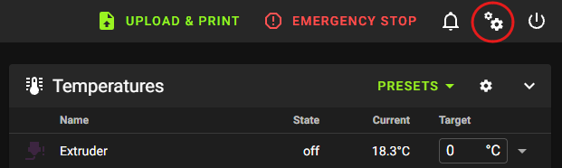
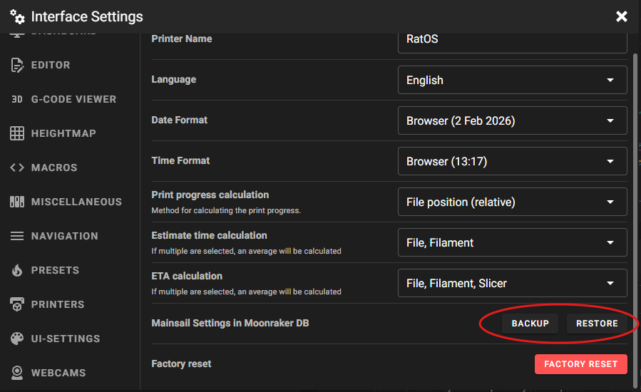

# Upgrading from RC3

Due to the significant changes in RatOS 2.1.0-RC4, RC4 requires a fresh installation of RatOS by flashing a new image to your SD card. It is not possible to upgrade an existing RatOS 2.1.0-RC3 installation to RC4 in-place.

:::warning Customized RC3 Configurations with beacon
RC3 users may have significantly customized their configuration and printing workflow, often while attempting to resolve first layer issues using the beacon probe. When upgrading to RC4, it is strongly recommended to evaluate printer functionality based on the default configuration and recommended workflow, using only those customizations that are strictly necessary to adapt to the specific hardware of your printer. This will ensure that you benefit from all the new beacon-related features and improvements in RC4, and avoid carrying over any problematic settings from RC3.

Notably, for completely stock-built V-Core 4.0 and 4.1 printers, no customizations should be necessary beyond selecting the correct printer model in the RatOS setup wizard. Calibrations and some user-dependent settings are still required as dicussed by the installation instructions, but customizations beyond this may interfere with the new features and improvements in RC4.
:::

:::info First Layers
If you are using a beacon probe, please read the [First Layers](configuration/first_layers.md) section, as there are significant improvements to first layer accuracy and consistency in RC4.
:::

## 1. Verify Board Pinouts and Wiring
:::danger Board Pinouts Changed
Please read this section carefully before proceeding with the upgrade to see if your printer is affected.
:::
:::warning Board documentation
The board documentation [here](boards/list.md) is in the process of being updated. For the time being, please refer to the source configuration files and wiring diagrams [here](https://github.com/Rat-OS/RatOS-configurator/tree/v2.1.x/configuration/boards) (2026-02-02)
:::
The setup wizard now supports additional categories of hardware:
- Filament sensors
- Chamber filter fans
- Chamber lighting
- Toolhead Alignment Systems (eg, Rat Rig VAOC)

Controlboard and toolboard pinouts have been expanded to support these new features. For some boards, this has resulted in changes to pin assignments for certain features.

### Stock-configured V-Core 4.0 and 4.1 printers
If you are using the standard controlboard and toolboards supplied with V-Core 4.0 and 4.1 kits by Rat Rig, and you have followed the official Rat Rig wiring guides for the printer and any official Rat Rig-supported accessories you have installed (Rat Pack, Dayspring LED strips, Orbiter Smart Filament Sensor), then RatOS should configure your printer correctly without any changes to wiring or pin assignments.

If you have made any customizations to the wiring connections of the printer or Rat Rig-supported accessories, you should either adjust your wiring to match the official Rat Rig wiring guides, or you will need to override the default pin assignments for any accessories you select in the setup wizard. This is beyond the scope of this guide.

### Other printers and custom setups
The supported features of existing boards have been updated and expanded. Some motor and pin definitions may have changed, especially for IDEX users.  Please check your wiring against wiring against the wiring diagrams and pin configuration files.

## 2. Backup existing configuration and files

### Backup configuration

Backup your existing `printer.cfg` and any custom files you may have added to your RatOS installation:
- In Mainsail, go to the `Machine` tab. Ensure that `config` is selected in the `Root` dropdown. Click the indicated checkbox to select all files.

- Unselect any files you do not wish to back up. In particular, be sure to unselect the `RatOS` directory as this is very large and does not contain any customizations. Then click the `Download` button to download a zip file containing your configuration files.

### Backup Mainsail settings (optional)
If you have made customizations to Mainsail settings (such as custom macro button groups), you may wish to back these up as well:
- Click the `Interface Settings` (cogs) icon in the top-right corner of Mainsail.

- Locate the `Mainsail Settings in Moonraker DB` section and click the `BACKUP` button. Refer to [Mainsail documentation](https://docs.mainsail.xyz/) for more information.

### Additional backups
- Ensure that you backup any other files that you need to keep and do not have a second copy of, such as G-code files.
- Advanced users may wish to backup the entire SD card image using tools such as `dd` or `Win32DiskImager`. This is beyond the scope of this guide.

## 2. Install RatOS 2.1.0-RC4

:::info V-Core 4.0 and 4.1 IDEX Commissioning
RC4 now fully generates the configuraton for IDEX printers, including VAOC support which includes automatic update of `crowsnest.conf`. The commissioning process has been simplified as a result, with no cut-and-paste into `printer.cfg` required. Please follow the relevant sections of the [V-Core 4.1 commissioning guide](https://docs.ratrig.com/v-core-4-1/commissioning-guide-hub/idex) after installing RC4.
:::

### Installation
Follow the [installation instructions](/docs/installation/).

### Initial Configuration
Follow the [initial configuration instructions](/docs/configuration/).

## 3. Selectively restore configuration

If you have custom hardware that is not supported by the RatOS setup wizard, you may need to selectively restore parts of your previous configuration. Note that the setup wizard now supports additional hardware categories, so you should avoid restoring any configuration related to features that are now supported by the setup wizard.

_Pay particular attention to the info note above regarding IDEX commissioning._

:::warning Duplicate Configuration
Do not blindly copy and paste substantial sections of your previous `printer.cfg` into the new installation. This may lead to duplicate configuration sections and conflicting settings, which can cause errors and unexpected behavior. Instead, carefully review your previous configuration and only restore the strictly necessary parts that are not covered by the updated RatOS setup wizard and generated configuration.
:::

As noted in the warning at the start of this guide, it is strongly recommended to evaluate printer functionality based on the default configuration and recommended workflow, using only those customizations that are strictly necessary to adapt to the specific hardware of your printer. This will ensure that you benefit from all the new features and improvements in RC4, and avoid carrying over any problematic settings from RC3.
